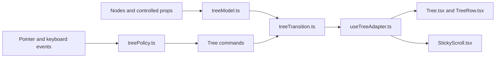

# @repo/ui

Generic React components for VS Code webviews. The package is currently
source-consumed by this monorepo; it does not ship a `dist` build yet.

Its stable separation boundary is the public root exports, no monorepo runtime
imports, and component CSS using only semantic `--ui-*` tokens. A future package
build can emit those same entry points without API changes.

Consumers compile these components with the React Compiler, so they follow the
rules of React and lean on it for memoization. A component that breaks the
rules is skipped silently rather than reported, which for a list or a tree
costs a re-render per row, so check with the compiler and not only the linter.

## CSS

Import the semantic token mapping and codicon assets once in each real webview
entry point:

```ts
import "@repo/ui/tokens.css";
import "@repo/ui/codicon.css";
```

`tokens.css` is the only layer that references VS Code's injected
`--vscode-*` variables. Components reference `--ui-*` tokens only.
`--ui-background` is the sidebar surface, the common webview host; a webview
hosted in an editor tab or bottom panel uses `--ui-panel-background` instead,
since VS Code gives webviews no host signal to resolve it automatically.

The radius and spacing tokens mirror VS Code's scale (`baseSizes.ts`), but
only the rungs components actually use are declared; add one when a component
needs it. Native menu, button, and hover paddings are hardcoded rather than
scale-derived, so parity-pinned values stay literals.

Component CSS is inherit-first: typography and text color come from the
webview (`font: inherit`), and controls center content with a fixed height
plus the shared `.ui-control` flex base in `components/control.css`.
Line-height and vertical padding math drift off-center with font metrics,
so components avoid them.

Every component forwards `className` and `style` to its root element, and
default rules use single-class specificity, so a consumer class imported
after the library overrides any default (width, height, spacing).

VS Code currently uses its stable UI by default; Modern UI remains behind the
experimental `workbench.experimental.modernUI` setting. `@repo/ui`
intentionally uses Modern UI as its package default because webviews receive no
host signal for that setting. The divergence is isolated: set
`data-ui-style="stable"` on the document root to restore stable row geometry,
focus behavior, and menu motion. Storybook's "UI style" toolbar switch toggles
that override live.

## Tree

`Tree` is controlled: `nodes` describe the hierarchy, `expandedIds` controls
branches, and the single- or multi-selection props control selection. Each
visible node renders as a flat `treeitem`, while normal keyboard navigation
keeps DOM focus on the `tree` container and identifies the active row with
`aria-activedescendant`. Focus and selection are independent.

```tsx
const [selectedItemId, setSelectedItemId] = useState("src");
const [expandedIds, setExpandedIds] = useState<readonly string[]>(["src"]);

<Tree
	aria-label="Explorer"
	variant="explorer"
	nodes={[
		{
			id: "src",
			label: "src",
			children: [{ id: "tree", label: "Tree.tsx", icon: "symbol-class" }],
		},
		{ id: "readme", label: "README.md", icon: "markdown" },
	]}
	expandedIds={expandedIds}
	onExpandedIdsChange={setExpandedIds}
	selectedItemId={selectedItemId}
	onSelectedItemChange={setSelectedItemId}
/>;
```

Ids must be unique across the whole tree, and a duplicate throws. A string
`label` is also the accessible name; a rich label must provide `textValue`. `children` marks a branch, including an empty array for a branch
whose children are still loading. `icon`, `action`, and `className` customize
the row. Actions stay live on plain hover, as in the native list, and are
isolated from row selection and expansion.

Arrow Up/Down, Home, End, PageUp/PageDown, and buffered prefix/fuzzy typing
move the active row through visible rows. Arrow Right
expands a branch or enters it; Arrow Left collapses it or moves to its parent.

`expandMode="singleClick"` is the default: clicking a branch selects
and toggles it, and Enter does the same. With `expandMode="doubleClick"`, a
single click or Enter only selects and a double click toggles expansion. Space
toggles a branch without selecting it, or selects a leaf. A normal-row twistie
toggles without changing selection. Alt-click recursively toggles descendant
branches unless Alt is configured as the multi-selection modifier.

Escape clears selection. It also clears the active focus mark when the tree has
at most one selected row; after a larger multi-selection, a second Escape
clears the remaining focus mark. Once neither selection nor a focus mark
remains, Escape is left to the host. The root `onKeyDown` runs first, so a host
can intercept shortcuts with `preventDefault()`.

`multiSelect` uses `selectedItemIds` and `onSelectedItemsChange` and sets
`aria-multiselectable`. `multiSelectModifier` chooses the toggle modifier:
`"ctrlCmd"` (the default) uses Ctrl/Cmd and `"alt"` uses Alt. Shift-click and
Shift+Arrow extend from the selection anchor; modifier clicks take precedence
over expansion. Ctrl/Cmd+A selects the visible rows in the active sibling
scope.

`stickyScroll` pins ancestors against the nearest scrolling ancestor. `true`
uses a maximum of seven pinned rows; a number supplies the maximum, and the
widget is also capped at 40% of the viewport. The pinned region is a separate
tab stop: Arrow Up/Down move among pinned ancestors, Arrow Down/Right from the
deepest row enters its first visible child, Enter reveals, focuses, and selects
the real row, Arrow Left reveals and focuses it and collapses an expanded
branch, and Space only reveals and focuses it. A plain pointer click reveals,
focuses, and selects; a pinned twistie additionally toggles the branch.
Selection-modifier clicks update selection without revealing the real row.

Webviews do not receive `workbench.tree.*` settings automatically. Consumers
that mirror native sticky-scroll preferences must read
`workbench.tree.enableStickyScroll` and
`workbench.tree.stickyScrollMaxItemCount` in the extension host and send the
values to the webview.



The model, policy, and transitions stay pure. The adapter owns React and DOM
integration. The flat visible model supports future windowing, but the Tree is
not currently virtualized.

Rows are 22px tall and keep the VS Code twistie gutter. For Explorer-style file
trees whose branches have no icons, `variant="explorer"` aligns leaf icons with
branch twisties; do not combine it with branch icons. Indent guides appear on
hover, selected ancestor paths stay active, and the focused path is active only
while the tree has focus. The package default uses inset Modern UI rows;
`data-ui-style="stable"` restores edge-to-edge square rows and stable focus
styling.

## Overlays

`Tooltip`, `ContextMenu`, and `DropdownMenu` wrap the Radix primitives,
styled to match the native VS Code menu and hover widgets. Menus expose
Radix's compound parts as flat named exports (`DropdownMenuTrigger`,
`DropdownMenuItem`, `DropdownMenuCheckboxItem`, …): checkbox and radio
items show a check in the icon gutter, `*Label` renders a group heading, and
`*Keybinding` renders a shortcut hint. Pass `keys` the same `key`/`mac`/
`win`/`linux` fields as a keybindings contribution to get the current OS's
binding in its native label style (`⇧⌘R` on macOS, `Ctrl+Shift+R`
elsewhere); `formatKeybinding` does the same for other surfaces, such as
tooltips.

`Tooltip` is a single component taking a `content` prop, and requires a
`TooltipProvider` ancestor. Mount one provider per app so that a pointer
moving between nearby triggers skips the show delay, like native hovers.
The delay defaults to 500ms, matching VS Code's `workbench.hover.delay`,
and tooltips stop growing at half the window height.

Overlay content is portalled to `body`, inherits webview typography from
there, and shares the `.ui-overlay` base for stacking, border, shadow,
and scrolling. Menus default to the Modern UI motion: they scale and fade in
from the trigger corner and fade out on close, with Radix holding unmount
until the exit animation ends. High contrast, `forced-colors`, and
`prefers-reduced-motion` are handled.

## Known gaps

- Overlay shadows are darker than native in dark themes: menus in VS Code
  use `shadow-lg`, which webviews cannot read, so the closest available
  `widget.shadow` stands in.
- Keybinding hints show the contributed defaults the consumer passes, not
  user remaps: VS Code exposes no API for extensions to resolve a command's
  effective keybinding.

## Codicons

`CodiconName` is derived directly from the installed
`@vscode/codicons/dist/metadata.json` keys. TypeScript validates icon names
without a generated source file or a runtime list in the public API.

## Isolation

ESLint rejects `@repo/*` imports and relative cross-package imports in
`packages/ui` TypeScript and TSX source. `react` remains a peer dependency;
the only runtime dependencies are the Radix overlay primitives and
`@vscode/codicons`. Public consumers import from the package root or its
declared CSS exports.

Shared internals are reached through `package.json` subpath imports (`#cx`,
`#codicons`, `#storybook`). These resolve only inside this package and ship
with it, so they survive a standalone NPM split. Component families keep
their own internals (contexts, stores) inside their folder and import them
relatively, so a family can lift out wholesale.
